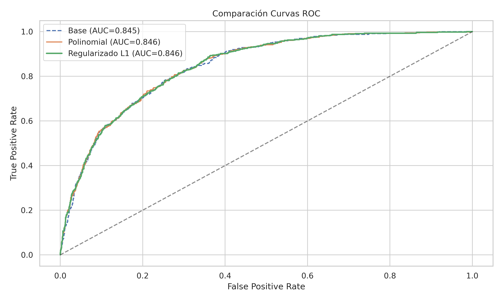
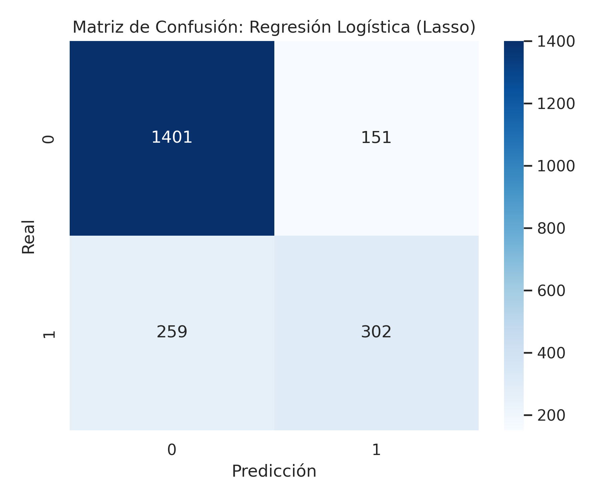
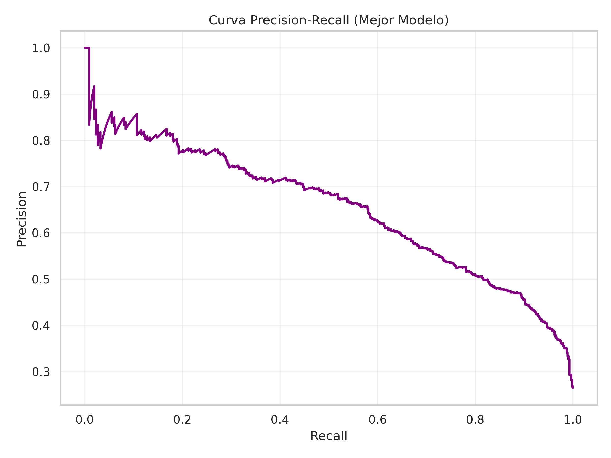

# Predicción de Fuga de Clientes: Regresión Logística Avanzada 📉🚫

Este repositorio contiene la solución a la **Actividad 1** de la asignatura **Machine Learning II**. El proyecto se centra en la construcción de modelos predictivos interpretables para identificar la fuga de clientes (*Churn*), utilizando técnicas avanzadas de ingeniería de características y regularización.

## 📄 Contexto del Problema

El objetivo es predecir la probabilidad de que un cliente abandone una empresa de telecomunicaciones. El desafío principal radica en:
1.  **Desbalance de Clases:** La mayoría de los clientes se quedan, lo que hace que el *Accuracy* sea una métrica engañosa.
2.  **No Linealidad:** Las relaciones entre el uso del servicio y la cancelación no siempre son lineales.

## 🛠️ Tecnologías y Metodología

**Stack:** Python, Pandas, Scikit-learn, Matplotlib, Seaborn.

**Flujo de Trabajo:**
1.  **Preprocesamiento:** Limpieza de datos (`TotalCharges`), imputación y codificación (`OneHotEncoder`, `StandardScaler`).
2.  **Modelo Base:** Regresión Logística estándar.
3.  **Ingeniería de Características:** Generación de **Polinomios de Grado 2** e interacciones para capturar patrones complejos.
4.  **Regularización y Selección:** Aplicación de **Lasso (L1)** para seleccionar automáticamente las variables relevantes y descartar el ruido generado por los polinomios.

## 📊 Resultados Visuales

### 1. Impacto de la Complejidad (Curvas ROC)
La inclusión de polinomios y la posterior regularización mejoraron la capacidad de discriminación del modelo, elevando el AUC significativamente respecto al modelo base.



### 2. Desempeño del Mejor Modelo (Lasso)
El modelo final (Polinomial + L1) logra un buen equilibrio, priorizando la precisión (evitar falsas alarmas) sobre el recall.



### 3. Trade-off Precisión-Recall
Dada la naturaleza del negocio, esta curva nos ayuda a decidir el umbral de corte óptimo según el presupuesto de retención disponible.



## 💡 Conclusiones Clave

* **Feature Selection Automático:** La regularización **L1 (Lasso)** fue fundamental. De las **36 variables** generadas (incluyendo interacciones complejas), el modelo **eliminó automáticamente el ~16%**, dejando solo las que realmente aportan valor predictivo.
* **Métricas:** Se alcanzó un **AUC-ROC de ~0.85**. Aunque el Accuracy es del 81%, el análisis crítico revela que el desafío persiste en el **Recall (54%)**, indicando que es difícil detectar a *todos* los clientes que se van sin generar muchos falsos positivos.

## 📂 Estructura del Repositorio

* `actividad1_ML2.ipynb`: Notebook con el código completo (Preprocesamiento, Modelado, GridSearch).
* `data-churn.csv`: Dataset utilizado.
* `images/`: Gráficos generados para este reporte.
* `requirements.txt`: Lista de dependencias.
* `README.md`: Documentación del proyecto.

## 💻 Instrucciones de Instalación

1.  Clonar el repositorio:
    ```bash
    git clone [https://github.com/sebamarinovic/actividad1_ML2.git](https://github.com/sebamarinovic/actividad1_ML2.git)
    ```
2.  Instalar dependencias:
    ```bash
    pip install -r requirements.txt
    ```
3.  Ejecutar el Notebook en Jupyter o Google Colab.

---
**Autor:** Sebastian Marinovic - Ricardo Lizana - Luis Gutierrez
**Asignatura:** Machine Learning II - CDD4018
**Fecha:** Diciembre 2025
